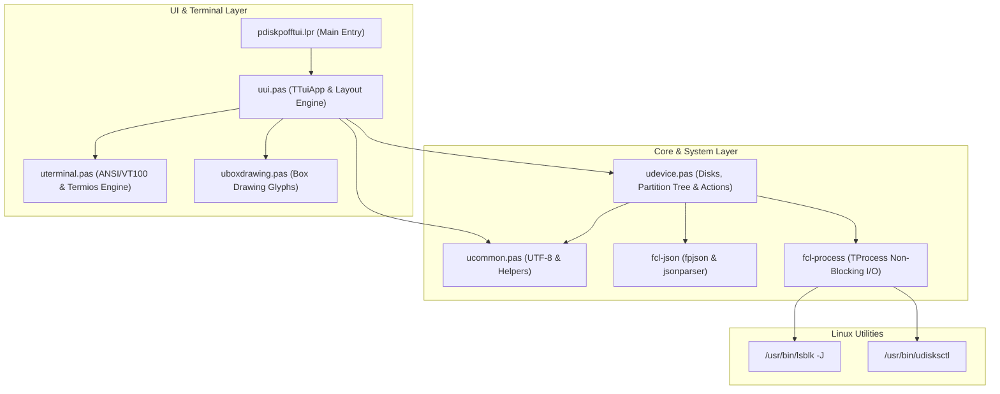

# Implementation Plan - D to Modern Free Pascal Rewrite for diskpoff-tui

## Goal Description
Rewrite the existing D console application (`diskpoff-tui` in [`original-d/`](file:///home/yur/agy-projects/miscalg/fpc/pdiskpofftui/original-d)) into idiomatic, high-performance, modern Free Pascal (FPC 3.2.2+). The application is an interactive Linux terminal manager for listing, mounting, unmounting, and powering off removable disks and block devices (supporting LUKS encryption and LVM hierarchies) using `lsblk` and `udisksctl`.

## Architecture Overview



---

## Technical Clarifications

> [!NOTE]
> ### 1. Free Pascal JSON Units (`fpjson` vs `jsonparser`)
> In Free Pascal's standard library (`fcl-json`), JSON functionality is cleanly split into two units:
> - **`fpjson`**: Provides the in-memory Document Object Model (`TJSONData`, `TJSONObject`, `TJSONArray`, `TJSONStringType`, etc.) used to query and navigate elements.
> - **`jsonparser`**: Implements the lexical scanner and parsing engine (`TJSONParser`, `GetJSON()`) to parse raw JSON text / streams into `TJSONData` structures.
> 
> They are separate so that applications generating JSON don't need to link the parser. For reading `lsblk -J` output, `jsonparser` parses the string into a `TJSONObject`, and `fpjson` accesses the nodes and arrays.

> [!NOTE]
> ### 2. UTF-8 Functions in RTL / LazUtils
> - FPC RTL provides conversions (`UTF8ToUnicodeString`, `UnicodeStringToUTF8` in `SysUtils`), but in pure FPC without external C libraries (`cwstring`/`libiconv`), measuring code-point display width for padding/truncating strings with multi-byte box-drawing characters is cleanest with either `LazUTF8` (from Lazarus `LazUtils`) or a lightweight native UTF-8 code point scanner in `ucommon.pas`.
> - `ucommon.pas` encapsulates this cleanly so the project compiles both via **Lazarus IDE (`.lpi`)** and standalone command-line **`fpc`** with 0 external package dependencies.

---

## User Review Required

> [!IMPORTANT]
> - **Zero External C Dependencies**: Pure Pascal ANSI/VT100 engine with `termio`/`baseunix` raw mode, `fcl-json`, and `fcl-process`. No ncurses or libtinfo required.
> - **Dual Build Support**: Full support for both **Lazarus IDE (`.lpi`) / `lazbuild`** and command-line **`make` / `fpc`**.

---

## Proposed Changes

### Component 1: Common Utilities & Box Drawing

#### [NEW] `src/uboxdrawing.pas`
- Defines `TBoxStyle` record with fields for horizontal (`H`), vertical (`V`), corner (`TL`, `TR`, `BL`, `BR`), tee (`TDown`, `TUp`, `TRight`, `TLeft`), and cross (`Cross`) characters.
- Provides standard box styles matching D:
  - `SingleStyle`: `─│┌┐└┘┬┴├┤┼`
  - `DoubleStyle`: `═║╔╗╚╝╦╩╠╣╬`
  - `DoubleHorizSingleVertStyle`: `═│╒╕╘╛╤╧╞╡╪`
  - `SingleHorizDoubleVertStyle`: `─║╓╖╙╜╥╨┠┨╫`

#### [NEW] `src/ucommon.pas`
- Defines standard types: `TStringArray = array of String;`.
- Implements UTF-8 code-point counting (`UTF8CharCount`) and code-point-aware substring extraction (`UTF8SubStr`).
- Implements `TruncateOrPad(const S: String; Width: Integer): String` for exact table column alignment and `...` truncation.
- Implements helper routines: `StringArrayContains`, `StringArrayJoin`, `StringArrayAddUnique`, and string replication.

---

### Component 2: Device Model & Subprocess Execution

#### [NEW] `src/udevice.pas`
- **Data Structures**:
  - `TCommandResult`: `ExitCode`, `Output`, `Error`, and `function IsSuccess: Boolean`.
  - `TPartitionInfo`: `Name`, `Path`, `Model`, `Vendor`, `Serial`, `Size`, `Fstype`, `LabelStr`, `Mountpoints`, `MountPaths`, `CryptLockPaths`, `Children: array of TPartitionInfo`, `MountedCount`, `CryptUnlockedCount`, and `TotalMountedOrUnlocked`.
  - `TDiskInfo`: `Path`, `Name`, `Serial`, `Size`, `DiskType`, `IsHotplug`, `IsRemovable`, `MountedCount`, `CryptUnlockedCount`, `MountPaths`, `CryptLockPaths`, `Partitions: array of TPartitionInfo`.
  - `TOperationResult`: `Success: Boolean`, `Message: String`.
  - `TBusyCallback = procedure(const TaskDesc: String) of object;`.
- **Parsing Logic (`ParseLsblkJson`)**:
  - Parses `lsblk -J` block device trees using `fpjson` and `jsonparser`.
  - Friendly disk name generation (`Model` containing `Vendor`, `Vendor + " " + Model`, `Model`, `Vendor`, or device `Name`).
  - Depth-first traversal (`CollectNodeDetails`): collects `mountPaths` and `cryptLockPaths` (leaves first), counts mounted filesystems and unlocked crypt containers.
  - Handles LVM on LUKS, LUKS over partitions, and nested device hierarchies.
- **Mount Candidate Filtering (`CollectMountablePartitionsForDisk`)**:
  - Skips swap partitions (`fstype="swap"`, `[SWAP]`).
  - Recurses into child devices for unlocked crypt/LVM.
  - Skips locked `crypto_LUKS` containers.
  - Categorizes devices into `candidatePaths` (to mount) and `alreadyMountedPaths`.
- **Subprocess & Busy Animation Engine (`RunCommandWithBusyAnimation`)**:
  - Executes commands non-blockingly using `TProcess` with pipes.
  - Periodic callback invocation (~60ms) to update animated spinner in the status bar while waiting for disk commands.
  - Captures and returns stdout and stderr.
- **High-Level Actions**:
  - `FetchDisks(OnBusy, out ErrorMsg)`: Runs `lsblk -J -o NAME,PATH,MODEL,SERIAL,HOTPLUG,RM,TYPE,MOUNTPOINTS,FSTYPE,UUID,SIZE,VENDOR,LABEL,REV`.
  - `MountSinglePartition(DevPath, OnBusy)`: Invokes `udisksctl mount -b <DevPath> --no-user-interaction`.
  - `MountDiskPartitions(Disk, OnBusy)`: Mounts all unmounted mountable partitions on the disk.
  - `UnmountAndLockPartition(DevPath, MountPaths, CryptLockPaths, OnBusy)`: Unmounts leaf filesystems first, then locks LUKS containers.
  - `UnmountAndLockDisk(Disk, OnBusy)`: Unmounts and locks all partitions on the disk.
  - `PowerOffDiskDevice(Disk, OnBusy)`: Performs unmount + lock, then calls `udisksctl power-off -b <DiskPath> --no-user-interaction`.
  - `FormatOpError(Action, DevPath, RawError)`: Strips udisksctl error boilerplate to provide clean error messages.

---

### Component 3: ANSI Terminal & Event Handling

#### [NEW] `src/uterminal.pas`
- **Low-Level Terminal Management**:
  - Detects interactive TTY with `fpisatty(StdInputHandle)` & `fpisatty(StdOutputHandle)`.
  - Sets non-canonical raw mode via `termio.TCSetAttr` (restoring original mode on exit).
  - Enters/exits Alternate Screen Buffer (`ESC [ ? 1049 h` / `ESC [ ? 1049 l`).
  - Hides/shows cursor (`ESC [ ? 25 l` / `ESC [ ? 25 h`).
  - Clears screen, moves cursor to `(X, Y)`, and sets colors (foreground/background, bright attributes).
  - Obtains live terminal dimensions (`TIOCGWINSZ`).
- **Key & Event Decoder (`PollKeyEvent`)**:
  - Uses `fpSelect` on stdin with configurable timeout.
  - Decodes ANSI escape sequences for:
    - Arrow keys (`Up`, `Down`, `Left`, `Right`)
    - `PageUp`, `PageDown`, `Home`, `End`
    - `Enter`, `Escape`, `q`/`Q`, `j`/`k`, `m`/`M`, `u`/`U`, `p`/`P`, `r`/`R`.

---

### Component 4: TUI Application & View Layout

#### [NEW] `src/uui.pas`
- **Row Model & Hierarchy Flattening**:
  - `TRowType = (rtDevice, rtPartition)`.
  - `TUiRow`: stores column texts (`DevCol`, `NameCol`, `SerialCol`, `MntCol`), tree prefixes (`├─ `, `└─ `, `│  `), mount/lock paths, expansion state.
  - `FlattenPartitions`: generates recursive tree representation matching D output.
- **Dynamic Layout & Rendering (`TTuiApp`)**:
  - Calculates proportional column widths (`dev`: ~25%, `serial`: ~18%, `mnt`: ~28%, `name`: remainder).
  - Draws top title bar with keyboard shortcuts:
    ` Removable Disks Manager (diskpoff-tui) ... [ J/K: Nav | Enter: Expand/Collapse | M: Mount | U: Unmount | P: Poweroff | R: Refresh | Q: Quit ] `
  - Draws double/single box-drawing table header, borders, and rows.
  - Highlights selected row with inverted colors (blue text on white background).
  - Renders bottom status bar with spinner animation during operations, green background on success, red on error.
  - Handles scrolling when rows exceed terminal height.
- **Interactive Event Loop (`Run`)**:
  - Handles navigation (`j`/`k`, Up/Down, PageUp/PageDown, Home/End).
  - Handles expand/collapse (`Enter`).
  - Dispatches Mount (`m`), Unmount (`u`), Power Off (`p`), Refresh (`r`), Quit (`q`/`Esc`).
  - Detects terminal resize and redraws.

---

### Component 5: Main Entry Point, Tests & Build System

#### [NEW] `pdiskpofftui.lpr`
- Program entry point: validates TTY, enters alternate screen buffer, manages `TTuiApp` lifecycle, and guarantees clean terminal restoration on exit.

#### [NEW] `pdiskpofftui.lpi`
- Lazarus Project Information file configuring compilation, search paths, target binary `bin/pdiskpofftui`, and build modes (`Debug`, `Release`) for the Lazarus IDE and `lazbuild`.

#### [NEW] `tests/test_runner.lpr` and `tests/test_runner.lpi`
- Standalone automated test suite verifying:
  - Parsing simple disks and partitions.
  - Parsing LUKS containers and nested children.
  - Parsing complex NVMe + LVM-over-LUKS configurations with swap.
  - Swap exclusion logic in mount candidates.
  - Depth-first unmount/lock path ordering.
  - Handling malformed JSON strings without crashes.
  - UTF-8 string padding, truncation, and char counting.

#### [NEW] `Makefile`
- Standard build targets:
  - `make` / `make all`: Compiles optimized binary `bin/pdiskpofftui`.
  - `make test`: Compiles and runs test suite `bin/test_runner`.
  - `make debug`: Compiles binary with line numbers and debug info (`-gl`).
  - `make clean`: Removes binary and build artifacts (`.o`, `.ppu`).
  - `make lazbuild`: Builds the project using `lazbuild` from the `.lpi` project files.

---

## Verification Plan

### Automated Tests
1. Compile and execute `tests/test_runner.lpr` via `make test` or `lazbuild`:
   ```bash
   make test
   ```
2. Verify that all test assertions pass (0 failures).

### Manual Verification
1. Run `pdiskpofftui` directly in an interactive terminal:
   ```bash
   ./bin/pdiskpofftui
   ```
2. Check terminal drawing:
   - Verify table borders, title bar, header, and status line.
   - Verify device listing matches `lsblk`.
   - Test navigation (`j`/`k`, Up/Down, PgUp/PgDn, Home/End).
   - Test expanding/collapsing disks (`Enter`).
   - Test refresh (`r`).
   - Test mount (`m`), unmount (`u`), and poweroff (`p`) on available removable storage devices.
   - Test terminal resize behavior.
   - Verify clean exit on `q` or `Esc` without leaving terminal in a broken raw state.
3. Test opening and building inside Lazarus IDE (`lazbuild pdiskpofftui.lpi`).
