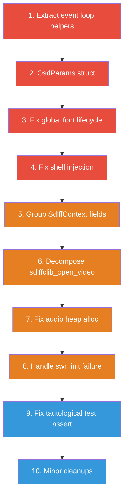

# sdlffc Refactoring Plan

## Goal

Improve the maintainability, readability, and robustness of the sdlffc codebase through targeted structural refactoring — without changing external behavior or the public API.

---

## User Review Required

> [!IMPORTANT]
> This plan proposes **structural refactoring only** — no new features, no API changes. All existing tests must continue to pass.

> [!WARNING]
> Item 4 (shell injection fix) is a **security fix**, not purely cosmetic. Item 7 (audio allocation) and item 8 (SwrContext failure) are **bug fixes** that improve robustness. Please review whether you want those included.

---

## Open Questions

> [!IMPORTANT]
> **Q1: Scope** — Would you like all 10 items, or a subset? Items are grouped by priority. I'd recommend at minimum the **High Priority** items (1–4).

> [!IMPORTANT]
> **Q2: Font path strategy** — Font loading searches hardcoded Linux paths (`/usr/share/fonts/truetype/...`) with a fallback to `SDL_RenderDebugText`. Is this acceptable, or should I add `SDL_GetBasePath()`-relative lookup?

> [!IMPORTANT]
> **Q3: Per-pixel alpha loop** — `fill_texture_with_frame_data` loops over every pixel setting `alpha = 255`. This is expensive at high resolutions. Should I investigate using `AV_PIX_FMT_BGR0` or SDL blend mode as a replacement, or is this out of scope?

---

## Codebase Analysis Summary

| File | Lines | Primary Concern |
|------|-------|----------------|
| [`sdlffclib.c`](file:///home/yur/agy-projects/miscalg/sdlffc/sdlffclib.c) | ~700 | Singleton `global_context`, shell injection in export, large `sdlffclib_main_loop` |
| [`video_render.c`](file:///home/yur/agy-projects/miscalg/sdlffc/video_render.c) | ~780 | Global `g_font_ctx` never cleaned up (dangling texture), CPU alpha loop, hardcoded font paths |
| [`demux_decoder.c`](file:///home/yur/agy-projects/miscalg/sdlffc/demux_decoder.c) | ~400 | Per-frame heap alloc in audio path, ignored `swr_init` failure, large `sdlffclib_open_video` |
| [`playback_thread.c`](file:///home/yur/agy-projects/miscalg/sdlffc/playback_thread.c) | ~200 | EOF spin loop with `SDL_Delay(10)`, hardcoded pre-roll threshold |
| [`frame_queue.c`](file:///home/yur/agy-projects/miscalg/sdlffc/frame_queue.c) | ~100 | Unused `not_empty` condition variable (overhead) |
| [`mailbox.c`](file:///home/yur/agy-projects/miscalg/sdlffc/mailbox.c) | ~120 | Uncancelable blocking send (potential deadlock) |
| [`sdlffclib_private.h`](file:///home/yur/agy-projects/miscalg/sdlffc/sdlffclib_private.h) | ~100 | 40+ field monolithic `_SdlffContext` struct |

---

## Proposed Changes

### High Priority

---

#### 1. Extract event-handling helpers from `sdlffclib_main_loop`

**Problem:** [`sdlffclib_main_loop`](file:///home/yur/agy-projects/miscalg/sdlffc/sdlffclib.c) is the main event loop mixing SDL event dispatch, keyboard handling, frame popping, rendering, and main-thread command processing. While `handle_key_should_quit` and `handle_pause_key` are already extracted, much of the loop body (frame timing, command processing, OSD state management) is inline.

**Proposed extraction** — new static functions in `sdlffclib.c`:

```c
static void process_main_thread_commands(SdlffContext *context);
static void pop_and_render_frames(SdlffContext *context);
static void handle_stream_end(SdlffContext *context);
```

The main loop becomes a clear pipeline:

```c
while (SDL_WaitEventTimeout(&event, timeout)) {
    // dispatch events
    switch (event.type) { ... }
    
    process_main_thread_commands(context);
    pop_and_render_frames(context);
    handle_stream_end(context);
}
```

**Files modified:** [`sdlffclib.c`](file:///home/yur/agy-projects/miscalg/sdlffc/sdlffclib.c)

---

#### 2. Introduce `OsdParams` struct for OSD rendering

**Problem:** [`render_timestamp_overlay`](file:///home/yur/agy-projects/miscalg/sdlffc/video_render.c) reads 15+ fields directly from `SdlffContext`. This tightly couples the renderer to the full private context.

**Proposed change** — define a parameter struct in [`video_render.h`](file:///home/yur/agy-projects/miscalg/sdlffc/video_render.h):

```c
typedef struct OsdParams {
    double  current_pts_sec;
    double  duration_sec;
    double  fps;
    bool    paused;
    bool    in_point_set;
    double  in_point_sec;
    bool    out_point_set;
    double  out_point_sec;
    bool    looping;
    int     overlay_mode;   // 0=top-left, 1=bottom-right, 2=hidden
    int     win_w;
    int     win_h;
} OsdParams;
```

Caller populates this struct from `SdlffContext` before calling the render function, decoupling the renderer from private state.

**Files modified:** [`video_render.h`](file:///home/yur/agy-projects/miscalg/sdlffc/video_render.h), [`video_render.c`](file:///home/yur/agy-projects/miscalg/sdlffc/video_render.c), [`sdlffclib.c`](file:///home/yur/agy-projects/miscalg/sdlffc/sdlffclib.c)

---

#### 3. Fix global font state lifecycle

**Problem:** `static FontContext g_font_ctx` in [`video_render.c`](file:///home/yur/agy-projects/miscalg/sdlffc/video_render.c) holds an `SDL_Texture*` that is never destroyed. If the renderer is destroyed (e.g., during `sdlffclib_done`), the texture becomes a **dangling pointer**. On any subsequent access or re-init, this causes undefined behavior.

**Proposed change:**

```c
// video_render.h — new API
void video_render_cleanup(void);  // destroys g_font_ctx.texture, resets state

// video_render.c
void video_render_cleanup(void) {
    if (g_font_ctx.texture) {
        SDL_DestroyTexture(g_font_ctx.texture);
        g_font_ctx.texture = NULL;
    }
    g_font_ctx.loaded = false;
    g_font_ctx.failed = false;
}
```

Call `video_render_cleanup()` in [`sdlffclib_done`](file:///home/yur/agy-projects/miscalg/sdlffc/sdlffclib.c) before destroying the renderer.

**Files modified:** [`video_render.h`](file:///home/yur/agy-projects/miscalg/sdlffc/video_render.h), [`video_render.c`](file:///home/yur/agy-projects/miscalg/sdlffc/video_render.c), [`sdlffclib.c`](file:///home/yur/agy-projects/miscalg/sdlffc/sdlffclib.c)

---

#### 4. Fix shell injection in FFmpeg export

**Problem:** [`ffmpeg_export_thread_cb`](file:///home/yur/agy-projects/miscalg/sdlffc/sdlffclib.c) uses `system(cmd)` with `snprintf`-assembled command strings. If `context->file_path` contains shell metacharacters (spaces, quotes, semicolons, backticks), this enables **arbitrary command execution**.

**Proposed fix** — shell-escape the filename, or use `fork`/`execvp` to bypass the shell entirely:

**Option A: Shell escaping (simpler)**
```c
static void shell_escape(const char *src, char *dst, size_t dst_size) {
    size_t j = 0;
    dst[j++] = '\'';
    for (size_t i = 0; src[i] && j < dst_size - 4; i++) {
        if (src[i] == '\'') {
            dst[j++] = '\''; dst[j++] = '\\'; dst[j++] = '\''; dst[j++] = '\'';
        } else {
            dst[j++] = src[i];
        }
    }
    dst[j++] = '\'';
    dst[j] = '\0';
}
```

**Option B: `execvp` (more robust, avoids shell entirely)**
```c
static int run_ffmpeg(const char *argv[]) {
    pid_t pid = fork();
    if (pid == 0) {
        execvp("ffmpeg", (char *const *)argv);
        _exit(127);
    }
    int status;
    waitpid(pid, &status, 0);
    return WIFEXITED(status) ? WEXITSTATUS(status) : -1;
}
```

I recommend **Option B** for correctness. The same fix should apply to `print_ffmpeg_command` (stdout output).

**Files modified:** [`sdlffclib.c`](file:///home/yur/agy-projects/miscalg/sdlffc/sdlffclib.c)

---

### Medium Priority

---

#### 5. Group `_SdlffContext` fields into logical sub-structs

**Problem:** [`_SdlffContext`](file:///home/yur/agy-projects/miscalg/sdlffc/sdlffclib_private.h) has 40+ flat fields mixing SDL resources, FFmpeg state, threading primitives, playback state, cut markers, UI state, and error display.

**Proposed grouping:**

```c
typedef struct {
    double in_point;
    double out_point;
    bool   markers_modified;
} CutMarkers;

typedef struct {
    int  overlay_mode;            // OverlayMode enum
    char error_msg_text[256];
    Uint64 error_msg_until_ticks;
} UiState;

typedef struct _SdlffContext {
    // SDL resources
    SDL_Window      *window;
    SDL_Renderer    *renderer;
    SDL_Texture     *video_texture;
    SDL_AudioStream *audio_stream;

    // Threading
    SDL_Thread     *video_thread;
    FrameQueue      frame_queue;
    MailBox         video_thread_mailbox;
    VideoThreadMsg  video_thread_mailbox_data;
    MailBox         main_thread_mailbox;
    MainThreadCommand main_thread_mailbox_data;
    SDL_AtomicInt   quit_requested;
    Uint32          main_thread_event;

    // Video file
    SdlffVideoFileContext video_file;
    char file_path[1024];

    // Playback timing
    Uint64 play_start_time;
    Uint64 pause_start_ticks;
    bool   paused;
    bool   stream_ended;
    bool   exit_at_end;

    // Cut & loop
    CutMarkers cut;
    bool       looping;

    // UI
    UiState ui;

    // Export
    bool ffmpeg_busy;
} SdlffContext;
```

This is a larger change that touches many files. All field access patterns (`context->in_point` → `context->cut.in_point`) need updating.

**Files modified:** [`sdlffclib_private.h`](file:///home/yur/agy-projects/miscalg/sdlffc/sdlffclib_private.h), [`sdlffclib.c`](file:///home/yur/agy-projects/miscalg/sdlffc/sdlffclib.c), [`video_render.c`](file:///home/yur/agy-projects/miscalg/sdlffc/video_render.c), [`playback_thread.c`](file:///home/yur/agy-projects/miscalg/sdlffc/playback_thread.c), test files

---

#### 6. Decompose `sdlffclib_open_video`

**Problem:** [`sdlffclib_open_video`](file:///home/yur/agy-projects/miscalg/sdlffc/demux_decoder.c) is ~180 lines handling file open, stream finding, codec open, SDL audio setup, SwrContext init, and metadata extraction.

**Proposed decomposition:**

```c
// demux_decoder.c — new static helpers
static AVCodecContext *open_video_stream(AVFormatContext *ic, int stream, const AVCodec *codec);
static AVCodecContext *open_audio_stream(AVFormatContext *ic, int stream, const AVCodec *codec);
// These already exist and are good ^

// Additional extraction:
static bool setup_audio_output(SdlffContext *context, AVCodecContext *audio_ctx);
static bool setup_resampler(SdlffVideoFileContext *ctx, AVCodecContext *audio_ctx);
```

**Files modified:** [`demux_decoder.c`](file:///home/yur/agy-projects/miscalg/sdlffc/demux_decoder.c)

---

#### 7. Fix per-frame heap allocation in audio decode path

**Problem:** In [`read_and_decode_next_packet`](file:///home/yur/agy-projects/miscalg/sdlffc/demux_decoder.c), `av_samples_alloc` + `av_freep` are called **on every decoded audio frame** (~50–100× per second). This is needless allocation churn in a real-time audio path.

**Proposed fix** — pre-allocate a reusable buffer in `SdlffVideoFileContext`:

```c
// sdlffclib_private.h — add to SdlffVideoFileContext:
uint8_t *resample_buf;
int      resample_buf_samples;  // current capacity

// demux_decoder.c — in audio decode path:
int dst_nb_samples = ...;
if (dst_nb_samples > ctx->resample_buf_samples) {
    av_freep(&ctx->resample_buf);
    av_samples_alloc(&ctx->resample_buf, NULL, channels, 
                     dst_nb_samples, AV_SAMPLE_FMT_FLT, 0);
    ctx->resample_buf_samples = dst_nb_samples;
}
// use ctx->resample_buf instead of local out_buf

// Free in sdlffclib_free_video_file_ctx:
av_freep(&ctx->resample_buf);
```

**Files modified:** [`sdlffclib_private.h`](file:///home/yur/agy-projects/miscalg/sdlffc/sdlffclib_private.h), [`demux_decoder.c`](file:///home/yur/agy-projects/miscalg/sdlffc/demux_decoder.c)

---

#### 8. Handle `swr_init` failure properly

**Problem:** In [`sdlffclib_open_video`](file:///home/yur/agy-projects/miscalg/sdlffc/demux_decoder.c), if `swr_init()` fails, it logs an error but continues. Later, `read_and_decode_next_packet` calls `swr_convert` on the invalid context → undefined behavior.

**Proposed fix:**

```diff
 if (swr_res < 0 || swr_init(ctx->swr_ctx) < 0) {
     SDL_LogError(SDL_LOG_CATEGORY_APPLICATION, "Failed to initialize SwrContext");
+    swr_free(&ctx->swr_ctx);
+    ctx->swr_ctx = NULL;
+    // Audio will be unavailable but video still plays
 }
```

And guard the audio decode path:

```diff
+if (ctx->swr_ctx) {
     // existing swr_convert / SDL_PutAudioStreamData code
+}
```

**Files modified:** [`demux_decoder.c`](file:///home/yur/agy-projects/miscalg/sdlffc/demux_decoder.c)

---

### Low Priority

---

#### 9. Fix tautological assertion in `test_stream_end_pause.c`

**Problem:** [Line 80](file:///home/yur/agy-projects/miscalg/sdlffc/test_stream_end_pause.c) contains:
```c
assert(context->stream_ended == false || context->exit_at_end == false);
```
Since `exit_at_end` was explicitly set to `false` on line 62, this assertion **always passes** regardless of `stream_ended`. It doesn't actually test anything.

**Proposed fix:**
```diff
-assert(context->stream_ended == false || context->exit_at_end == false);
+assert(context->stream_ended == false);
```

**Files modified:** [`test_stream_end_pause.c`](file:///home/yur/agy-projects/miscalg/sdlffc/test_stream_end_pause.c)

---

#### 10. Minor cleanups

| Item | File | Description |
|------|------|-------------|
| Remove unused `not_empty` condition | [`frame_queue.c`](file:///home/yur/agy-projects/miscalg/sdlffc/frame_queue.c) | Created, signaled, destroyed but never waited on — pure overhead |
| Remove commented `#add_project_arguments('-fanalyzer')` | [`meson.build`](file:///home/yur/agy-projects/miscalg/sdlffc/meson.build) | Dead commented code |
| Delete `README.md~` | project root | Backup file shouldn't be tracked |
| Guard mailbox blocking send | [`mailbox.c`](file:///home/yur/agy-projects/miscalg/sdlffc/mailbox.c) | Add quit-check to `mailbox_send` to prevent indefinite blocking if consumer exits |

---

## Verification Plan

### Automated Tests

```bash
./build.sh
meson test -C _build
```

All 5 existing tests must pass unchanged (except item 9 which intentionally fixes a test).

### Manual Verification

1. Run `./run.sh` and verify:
   - Video plays smoothly with audio sync
   - All keyboard shortcuts work: `Space`, `←`/`→`, `[`/`]`, `I`/`O`, `Shift+I`/`Shift+O`, `L`, `V`, `Enter`, `Ctrl+Enter`, `B`, `E`, `Q`/`Esc`
   - OSD displays correctly in all 3 positions (top-left, bottom-right, hidden)
   - Cut markers and FFmpeg command output work
   - Clean shutdown (no hangs on quit)
2. Test with a filename containing spaces/quotes to verify shell injection fix (item 4)
3. Optionally: `valgrind ./_build/sdlffc samplevideo.mp4` for brief session to verify no memory leaks from font cleanup fix

---

## Execution Order



**Legend:** 🔴 High priority  🟠 Medium priority  🔵 Low priority
