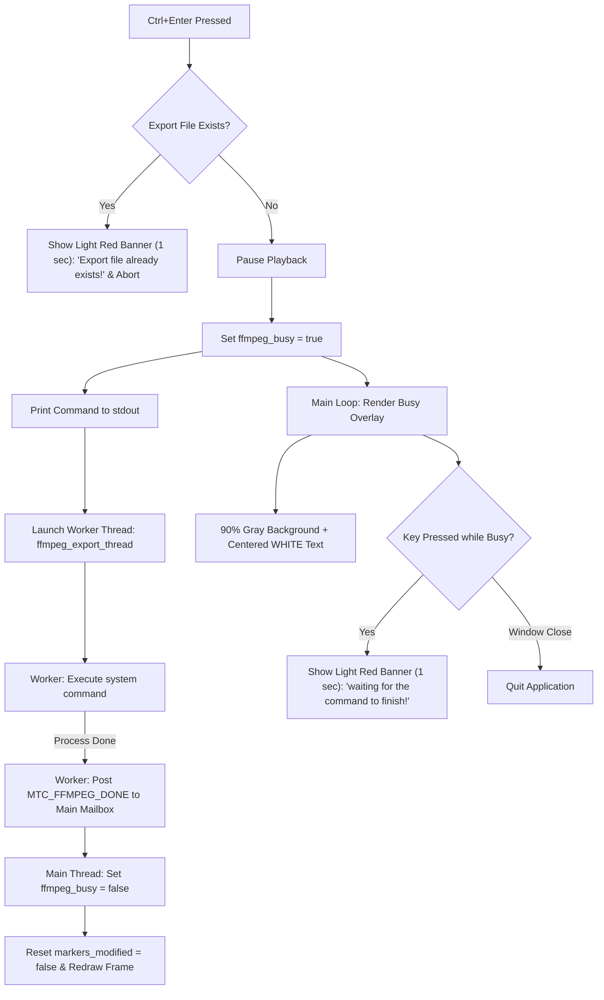

# Asynchronous FFmpeg Export & Busy Overlay Plan (Updated)

This document outlines the design and implementation strategy for adding `Ctrl+Enter` non-blocking FFmpeg command execution, a full-window 90% gray busy overlay with white centered text, export file existence checks, and key input interception with a 1-second light red error banner in `sdlffc`.

## Goal Description
Enhance `sdlffc` with interactive command execution:
1. **Shortcut `Ctrl+Enter`**:
   - Checks if the destination export file already exists.
     - If the file exists: displays a light red error banner at the bottom of the window for 1 second (`"Export file already exists!"`) and **does not proceed**.
   - If the destination file does not exist:
     - Pauses video playback.
     - Sets busy state (`ffmpeg_busy = true`).
     - Displays a full-window 90% gray busy overlay with centered **white** message `"ffmpeg command is in progress..."`.
     - Prints the FFmpeg cut command to `stdout`.
     - Executes the command asynchronously in a dedicated worker thread (`SDL_CreateThread`), inheriting `stdout` and `stderr` without blocking the main event loop.
2. **Behavior during Execution**:
   - Only window close events (`SDL_EVENT_QUIT`) can exit the application.
   - Any other key press is intercepted and displays a light red banner at the bottom of the window with white text `"waiting for the command to finish!"` for 1 second.
3. **Completion**:
   - Upon completion, the worker thread notifies the main thread (`MTC_FFMPEG_DONE`).
   - The main thread clears the busy state, resets `markers_modified = false`, and redraws the current video frame.

---

## User Review Required

> [!IMPORTANT]
> **File Existence Guard**: Pressing `Ctrl+Enter` will check for the target export file before executing. If the output file already exists, execution is aborted immediately, and a 1-second light red error banner is displayed (`"Export file already exists!"`).

> [!IMPORTANT]
> **White Centered Text on Busy Overlay**: The busy overlay background is 90% opacity gray (`RGBA: 230, 230, 230, 230`) with centered **white** text (`"ffmpeg command is in progress..."`).

---

## Proposed Changes

### 1. Data Structures & Commands (`sdlffclib_private.h`)

#### [MODIFY] [sdlffclib_private.h](file:///home/yur/agy-projects/miscalg/sdlffc/sdlffclib_private.h)
- Add `MTC_FFMPEG_DONE` to `MainThreadCommand` enum.
- Add fields to `_SdlffContext`:
  - `bool ffmpeg_busy;`
  - `Uint64 error_msg_until_ticks;`
  - `char error_msg_text[256];`

---

### 2. Helper Functions & Key Interception (`sdlffclib.c`)

#### [MODIFY] [sdlffclib.c](file:///home/yur/agy-projects/miscalg/sdlffc/sdlffclib.c)
- **`get_export_filename`**: Helper function to calculate output path `<basename>_<IN_HH_MM_SS_sss>_<OUT_HH_MM_SS_sss>.<ext>`.
- **`handle_key_should_quit`**:
  - Handle `Ctrl+Enter`:
    - Compute `out_filename`.
    - Check file existence (`fopen` or `access(out_filename, F_OK) == 0`).
    - If file exists:
      - Set `snprintf(context->error_msg_text, sizeof(context->error_msg_text), "Export file already exists!");`
      - Set `context->error_msg_until_ticks = SDL_GetTicksNS() + 1000000000ULL` (1 sec).
      - Redraw current frame.
      - Return `false` (do not execute).
    - If file does not exist:
      - Pause playback.
      - Set `context->ffmpeg_busy = true`.
      - Launch worker thread.
  - Handle key presses while `ffmpeg_busy` is true:
    - Set `snprintf(context->error_msg_text, sizeof(context->error_msg_text), "waiting for the command to finish!");`
    - Set `context->error_msg_until_ticks = SDL_GetTicksNS() + 1000000000ULL`.
    - Redraw frame.
    - Return `false`.

---

### 3. Busy Overlay & Warning Banner Rendering (`video_render.c`)

#### [MODIFY] [video_render.c](file:///home/yur/agy-projects/miscalg/sdlffc/video_render.c)
- **Busy Overlay**:
  - Fill full window with 90% opacity gray (`RGBA: 230, 230, 230, 230`).
  - Render centered **white** text (`"ffmpeg command is in progress..."`).
- **Error Warning Banner**:
  - If `SDL_GetTicksNS() < context->error_msg_until_ticks`:
    - Fill bottom 40px bar with light red (`RGBA: 255, 100, 100, 240`).
    - Render centered **white** text using `context->error_msg_text` (or fallback string).

---

## Verification Plan

### Automated Tests
1. Run `./build.sh` to compile cleanly.
2. Run `meson test -C _build` to execute all tests.

### Manual Verification
1. Run `./_build/sdlffc samplevideo.mp4`.
2. Test `Ctrl+Enter` when export file exists:
   - Create dummy file matching export name `samplevideo_00_00_00_000_...`.
   - Press `Ctrl+Enter` -> verify `"Export file already exists!"` light red banner appears for 1 second and command is aborted.
3. Test `Ctrl+Enter` when export file does not exist:
   - Remove dummy file.
   - Press `Ctrl+Enter` -> verify playback pauses, 90% gray busy overlay with white text appears, command runs asynchronously in background, and completion restores normal state.
