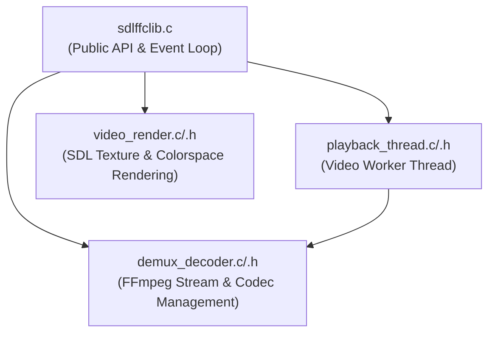

# Refactoring Plan: Splitting `sdlffclib.c`

## Overview & Language Scope
The project configuration (`meson.build` and `AGENTS.md`) defines this codebase as a **C99** project (`c_std=c99`). The module breakdown below splits `sdlffclib.c` (~1,070 lines) into separate standard C module files (`.c` and `.h`).

---

## 1. High-Level Architecture



---

## 2. Module Breakdown & Function Mapping

### **Module A: `video_render.h` / `video_render.c`**
* **Responsibility**: Manages SDL texture allocation, pixel format mappings, `sws_scale` color conversion, and GPU rendering/letterboxing.
* **Functions**:
  - `get_texture_format()`
  - `get_frame_colorspace()`
  - `create_video_texture_properties()`
  - `create_or_reuse_cached_texture()`
  - `FreeSwsContextContainer()`
  - `fill_texture_with_frame_data()`
  - `render_frame_main_thread()`

### **Module B: `demux_decoder.h` / `demux_decoder.c`**
* **Responsibility**: Interfacing with FFmpeg for demuxing streams, allocating/freeing AVFormat/AVCodec contexts, and decoding video/audio frames & packets.
* **Functions**:
  - `open_video_stream()`
  - `open_audio_stream()`
  - `sdlffclib_free_video_file_ctx()`
  - `read_and_decode_next_packet()`
  - `sdlffclib_open_video()`
  - `sdlffclib_fileinfo()`

### **Module C: `playback_thread.h` / `playback_thread.c`**
* **Responsibility**: Video decoding background thread lifecycle and mailbox command handling.
* **Functions**:
  - `process_video_thread_commands()`
  - `video_thread_cb()`

### **Module D: `sdlffclib.c` (Refactored Core Engine)**
* **Responsibility**: Library initialization/cleanup, main loop event handling, user input (keyboard/seeking), and timing control.
* **Functions**:
  - `seconds_from_nanoseconds()`
  - `send_main_thread_event()`
  - `sdlffclib_init()`
  - `sdlffclib_done()`
  - `handle_key_should_quit()`
  - `handle_seek()`
  - `sdlffclib_main_loop()`

---

## 3. Proposed Module Interfaces

### `video_render.h`
```c
#pragma once
#include "sdlffclib_private.h"

// Renders an AVFrame into the SDL window context (main thread)
void render_frame_main_thread(SdlffContext *context, AVFrame *frame);
```

### `demux_decoder.h`
```c
#pragma once
#include "sdlffclib_private.h"

bool demux_decoder_open(SdlffContext *context, const char *file_path);
void demux_decoder_free(SdlffVideoFileContext *ctx);
void demux_decoder_read_next_packet(SdlffContext *context);
bool demux_decoder_dump_info(const char *file_path);
```

### `playback_thread.h`
```c
#pragma once
#include "sdlffclib_private.h"

// Callback function for SDL_CreateThread
int SDLCALL video_thread_cb(void *data);
```

---

## 4. `meson.build` Modifications

In `meson.build`, update the source list:

```meson
src = [
  'sdlffc.c',
  'sdlffclib.c',
  'video_render.c',
  'demux_decoder.c',
  'playback_thread.c',
  'mailbox.c',
  'frame_queue.c',
]
```

---

## 5. Benefits Summary
1. **Reduces `sdlffclib.c` size**: From ~1,070 lines down to ~250 lines.
2. **Decouples FFmpeg decoding** from **SDL GPU rendering**.
3. **Improves testability**: Format conversion, decoding, and probe logic become isolated modules.
